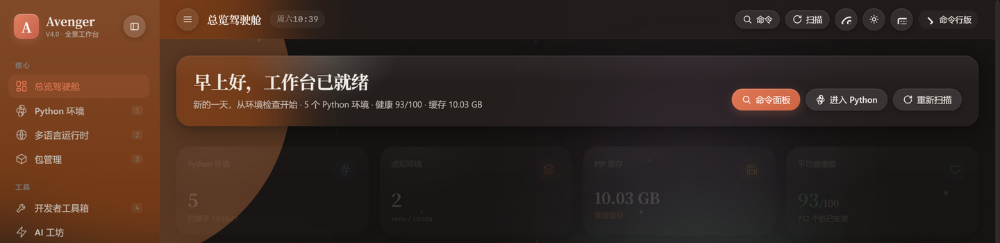

# 🚀 Avenger — 全栈开发者全景工作台

> **One local dashboard for your entire dev toolchain.**
> 液态玻璃美学 · 零第三方依赖 · 纯本地离线运行 · 数据永不上传



**Avenger** 是一个运行在 Windows 本机的一站式开发者工作台：Python 多环境管理、多语言运行时检测、AI 大模型工坊（18 家供应商 + 流式输出）、编程练习场（26 题 kata）、开发者备忘录、速查学习库、硬件监控、编程健康护航……全部装进一个**液态玻璃质感**的本地网页。

---

## 📖 目录

- [为什么做这个项目](#-为什么做这个项目)
- [版本演进史 v1.0 → v4.0](#-版本演进史-v10--v40)
- [技术依托](#-技术依托)
- [特点特色](#-特点特色)
- [功能总览](#-功能总览)
- [安装与运行](#-安装与运行手把手)
- [AI 大模型接入指南](#-ai-大模型接入指南)
- [快捷键](#-快捷键)
- [后续目标 Roadmap](#-后续目标-roadmap)
- [参与贡献](#-参与贡献)
- [许可证](#-许可证)

---

## 💡 为什么做这个项目

开发者在 Windows 上日常要面对一群"各自为政"的工具：

- 管理多个 Python 环境要用 `py` / `conda` / `pip` 命令来回切换；
- Node、Go、Java、Docker 的版本各查各的；
- AI 编程助手要为每家供应商单独装客户端；
- 刷题开 LeetCode、记笔记开 Obsidian、看硬件开任务管理器……
- 这些工具几乎都是 Electron 套壳：**几百 MB 内存起步，还总想联网**。

**Avenger 的回答是：一个 100% 本地、零第三方 Python 依赖、单文件前端的轻量工作台。**
双击一个 BAT 就能启动，占用极低，断网可用，所有数据（笔记、AI Key、偏好）只存在你自己的磁盘上。它把"开发环境管控 + AI 工坊 + 练习场 + 备忘录 + 学习库 + 硬件监控 + 健康提醒"合并成一个页面，让编程更方便、更安全、更健康。

---

## 📜 版本演进史 v1.0 → v4.0

### v1.0 ~ v2.0 — 命令行时代：Python 环境管理器
项目起点是一个纯 BAT 脚本（`PythonEnvManager.bat`，至今保留作为命令行兜底）：扫描系统 Python、列出包、升级卸载。功能可用，但体验和"管理"无关。

### v2.1 — 图形化：Web UI 诞生
引入 `http.server` 后端 + 单文件 HTML 前端，实现环境扫描、包列表虚拟滚动、pip 缓存管理、依赖冲突诊断与一键修复。**"环境管理"升级为"环境治理"**：健康度评分、PATH 拖拽排序、requirements 导出、备份回滚都在这一阶段成型。

### v3.0 — 转型：全栈开发者全景工作台
产品定位从"Python 管理器"跃迁为"开发者工作台"：
- **视觉系统重构**：Apple iOS 26 / visionOS 风格的 Liquid Glass 五层液态玻璃材质、tsParticles 粒子背景、40+ 枚手绘 SVG 线性图标（彻底告别 emoji）、弹簧物理动效；
- **模块扩张**：多语言运行时检测、开发者工具箱、数据库面板、Git 辅助、端口进程、硬件监控、编程健康、插件市场——共 11 大模块。

### v3.1 ~ v3.2 — 打磨：框架与体验
- 模块化渲染框架（按需挂载、自动回收）、导航令牌机制解决异步竞态；
- 命令面板 `Ctrl+K`（支持 `> scan` 斜杠命令）、跨环境包搜索、磁盘占用矩形树图、操作撤销栈（Ctrl+Z）。

### v3.3 — 工作室与安全基座
- **托管小窗**（tkinter）：关掉浏览器后服务继续保活，关掉小窗才真正退出；
- 新增 **AI 工坊 / 开发者备忘录(SQLite) / 编程练习场 / 速查学习** 四大内容模块的雏形；
- 安全加固：会话令牌、Host/Origin 校验（防 DNS rebinding）、CSP、AI 供应商地址白名单。

### v5.0 — Agent 生态（当前版本）
| 方向 | 内容 |
|------|------|
| 🧩 Agent Skills | 12 个内置 SKILL.md 技能（开放标准），一键安装到 `~/.avenger/skills`，扫描 Claude 技能目录，支持自建 |
| 🔌 MCP 生态 | 18 个精选 MCP 服务器目录 + 本机 5 类客户端配置扫描（Claude Desktop/Code、Cursor、VS Code、.mcp.json）+ 一键生成接入配置；**内置纯标准库 stdio MCP Server**（`avenger_mcp_server.py`，5 个工具） |
| 🕸️ Harness 工坊 | 单文件零依赖 Coding-Agent 框架生成器（function-calling 循环、工具注册、越界防护、本地记忆） |
| 🧠 记忆·上下文 | Agent 长期记忆（SQLite，5 类目检索）+ 项目上下文包生成（CONTEXT_PACK.md：概况/结构/关键文件/符号清单） |
| 🏭 模型工坊 | 量化档位×显存测算（权重/KV 拆解）、本机 GPU 推荐组合、Ollama/llama.cpp 部署命令；训练侧 6 大框架配方（Unsloth/LLaMA-Factory/TRL/Axolotl/torchtune/从零）、六步工作流、数据集体检器、训练显存预估、配方生成 |
| 🖥️ AI-IDE | CLAUDE.md / AGENTS.md / .cursorrules / copilot-instructions 生成器 |
| 🎨 UI/UX | 引入 Anime.js 编排（弹簧入场+数字滚动，离线优雅降级）；编辑部式 masthead、发丝线台账行、非对称栅格，摆脱均质卡片布局 |

### v5.2 — 手机直连 · Agent 生态补全 · 训练闭环（当前版本）
| 方向 | 内容 |
|------|------|
| 📱 手机直连 | LAN 模式热切换（0.0.0.0）+ 6 位配对码换令牌协议；手机浏览器获得全部 19 模块操控权；云端模式支持 Tailscale 组网 |
| 🧩 技能组合包 | 多选技能合并为单一 skill-pack.md（含冲突消解规则） |
| 🕸️ Harness v2 | Python/Node 双语言；指数退避重试×3；token 预算；MCP Server 补全 resources/prompts 协议；配置体检器 |
| 🧠 记忆治理 | 关联记忆推荐（标签+关键词重合度）；按类目/天数批量清理 |
| 🚀 一键部署 | 模型卡直出部署 BAT（检测→winget 装 Ollama→pull→run） |
| 🖥️ AI-IDE | VS Code/Cursor 扩展脚手架生成（解释/优化/审查三命令，vsce 即打包） |
| 🏋️ 训练闭环 | 数据清洗器 + 耗时预估公式 + 过拟合风险顾问（早停判据）+ 数据集登记库 |
| ✨ UI | 开机动画；Anime.js v4 适配器；≤720px 多分辨率适配修复 |

### v5.1 — 模型库 · 使用统计 · 动效引擎
| 方向 | 内容 |
|------|------|
| 📼 模型库 | 13 个热门开源模型家族 × 22 个量化变体（Qwen3 / DeepSeek-R1 / Llama / GLM / Phi-4 / Gemma3…），基于 nvidia-smi 实测显存给出 **显存充裕 / 可内存卸载 / 显存不足** 三态判定；Ollama 运行时自动识别已下载模型；下载/启动命令一键复制；GPU/内存实时仪表 |
| 📊 使用统计 | AI 对话用量入库（SQLite），驾驶舱新增 Claude Code 风格统计卡：活跃天 / 消息数 / 输出 tokens / 当前与最长连胜 / 峰值时段 / 常用模型 + **17 周 GitHub 式热力图**（错落弹入动画） |
| ✨ 动效引擎 | 升级 **Anime.js v4**（animejs.com 新 API），内置 v4/v3 双版本适配器与离线降级；新增热力图与列表错落弹入动画、数字滚动计数 |
| 🗃️ 数据集登记库 | 数据集体检通过后一键登记（SQLite），形成个人微调数据库；训练配方一键引用已登记数据集 |

### v4.0 — 跨越式升级
| 方向 | 升级内容 |
|------|----------|
| ⚡ 性能 | 粒子脚本不再阻塞首屏（离线自动切 canvas 引擎）；驾驶舱快照秒开；环境扫描多线程并行（3-6×）；包计数 `importlib.metadata`（~10×） |
| 🤖 AI | **流式打字机输出**（可随时停止）；18 家 OpenAI 兼容供应商；6 种专家角色；温度调节；对话历史；测试连接 |
| 🏋️ 练习场 | 26 题 kata；难度/主题筛选；进度环；连胜天数；今日挑战；草稿自动保存；本地 isolated 判题 |
| 📝 备忘录 | 搜索 / 标签筛选 / Markdown 预览 / Ctrl+S / JSON 导入导出 |
| 📚 速查 | 18 篇速查（Git/Docker/PowerShell/asyncio/Vim…）+ 搜索 + 一键复制 |
| 🎨 个性化 | 12 套液态玻璃皮肤（含氛围光斑）；10 只可拖拽、会说话的桌面宠物 |
| 🛡️ 健壮性 | 包名严格校验防 pip 注入；缓存清理白名单；请求体解析容错；日志自动轮转；任务句柄回收 |
| 🎛️ 可调节 | 粒子密度四档；玻璃质感三档（低配机一键降载） |

---

## 🏗️ 技术依托

Avenger 刻意选择了"**最朴素的技术栈，最讲究的体验**"：

| 层 | 实现 | 说明 |
|----|------|------|
| 后端 | Python 标准库 `http.server` | ThreadingHTTPServer + REST API，**零第三方 pip 依赖**，Python 3.8+ 可跑 |
| 环境探测 | `winreg` / `ctypes` / `subprocess` | 注册表 + PATH + 常见目录 + Conda 多源扫描；CPU/内存走 `GetSystemTimes` / `GlobalMemoryStatusEx`，GPU 走 `nvidia-smi` |
| 前端 | 单文件 `avenger.html` | 内嵌全部 CSS/JS，无构建、无框架、无 node_modules |
| 视觉 | CSS `backdrop-filter` 五层液态玻璃 | 弹簧曲线 `cubic-bezier(.32,.72,0,1)`；三档质感降级 |
| 粒子 | tsParticles（CDN 动态加载） | 加载失败/离线自动切换内置 canvas 引擎；<50fps 自动降级 |
| AI 代理 | `urllib` + SSE 解析 | 后端解析供应商流式响应并转发为纯文本流；供应商域名白名单，Key 只存本机 |
| 判题 | `subprocess` + `python -I` | kata 代码在隔离模式运行，8 秒超时，隐藏测试用例留在服务端 |
| 存储 | SQLite (`sqlite3`) + JSON + localStorage | 笔记、AI 配置、UI 偏好全部本地文件 |
| 托管小窗 | tkinter | 纯标准库 GUI，保活服务 + 实时状态 + 宠物同步 |

**安全模型**：仅监听 `127.0.0.1`、每次启动轮换会话令牌、Host/Origin/Sec-Fetch-Site 三重校验、CSP、危险操作白名单 + 二次确认 + 自动备份 + 撤销栈。

---

## ✨ 特点特色

- **🪶 轻**：零 pip 依赖、零构建链，clone 下来就能跑；内存占用远低于 Electron 系工具
- **🔌 离线优先**：没有网络，粒子、判题、笔记、环境管理、硬件监控全部照常工作（AI 与安全漏洞库除外，均有离线降级）
- **🔒 隐私彻底**：无遥测、无云依赖；AI Key 存在本地 `avenger_secrets.json`，请求由本机代理直连供应商
- **🎨 有品位的界面**：液态玻璃 + 氛围光斑 + 微交互光点 + 12 皮肤 × 10 宠物 × 深浅主题，还能拖一只宠物陪你写代码
- **🧊 流畅**：所有动画只动 `transform`/`opacity`；虚拟滚动扛住千级包列表；帧率过低自动降级特效
- **🧯 安全兜底**：危险操作输确认词、自动备份、Ctrl+Z 撤销、快照对比；BAT 命令行版全程可用
- **❤️ 关心开发者本人**：20-20-20 护眼、久坐/饮水提醒、编程时长统计、设备高负载休息提示

---

## 📦 功能总览（16 大模块）

| 模块 | 能力 |
|------|------|
| 📊 总览驾驶舱 | 快照秒开、环境统计、CPU/内存实时图表、健康雷达、扫描进度、最近操作 |
| 🐍 Python 环境 | 多源扫描、健康评分、PATH 拖拽排序、venv/Conda 创建克隆删除、多环境对比 |
| 🌍 多语言运行时 | Node/Go/Java/Rust/PHP/Ruby/.NET/Docker/Git 检测 + 官方下载指引 + 项目运行时探测 |
| 📦 包管理 | 虚拟滚动、版本切换、依赖树/力导向图、批量升级、跨环境搜索、安全扫描(OSV) |
| 🤖 AI 工坊 | 流式对话、18 家供应商、6 种角色、Markdown 渲染、历史记录、连接测试 |
| 📝 备忘录 | SQLite 笔记、标签、置顶、MD 预览、搜索、导入导出 |
| 🏋️ 练习场 | 26 题 kata、筛选、进度环、连胜、今日挑战、本地判题、草稿 |
| 📚 速查学习 | 18 篇速查 + 搜索 + 复制 |
| 🧰 工具箱 | JSON/正则/编码/哈希/密码/时间戳/颜色/JWT/UUID/Cron/SQL/HTML→JSX/diff/本机HTTP/片段/进制/URL |
| 🗄️ 数据库 | MySQL/PG/Redis 端口探测、SQLite 只读浏览 |
| 🌿 Git 辅助 | 仓库扫描、分支、提交概览 |
| 🔌 端口进程 | 端口占用列表、一键终止 |
| 🖥️ 硬件监控 | CPU/内存/GPU/磁盘/电池、实时图表、磁盘树图下钻 |
| ❤️ 编程健康 | 护眼提醒、久坐休息、饮水提醒、时长统计、护眼暖色模式 |
| 🧩 插件市场 | 核心模块开关 + 声明式插件 API（`/api/plugin/<id>/<action>`） |
| ⚙️ 设置 | 皮肤画廊、宠物网格、粒子/玻璃性能档、主题、护眼定时、数据管理 |

---

## 🚀 安装与运行（手把手）

### ① 前置要求

| 要求 | 说明 |
|------|------|
| Windows 10 / 11 | 深度使用注册表、wmic、tkinter 托管小窗等 Windows 能力 |
| Python 3.8+ | **必须包含 tkinter**（官方安装包默认自带） |
| 浏览器 | Edge / Chrome 等现代 Chromium 浏览器 |
| 就这些 | ✅ 不需要 pip install 任何东西，不需要 Node，不需要 Docker |

> 没装 Python？去 [python.org/downloads](https://www.python.org/downloads/) 下载安装，**安装时务必勾选 "Add Python to PATH"**。

### ② 获取代码

```bash
git clone https://github.com/LYL-Z/avenger.git
cd avenger
```

也可以在 GitHub 页面点 **Code → Download ZIP** 直接解压。

### ③ 启动（三选一）

**方式 A：一键启动（推荐）**

双击 `一键启动Avenger.bat`。它会自动：
1. 检测 `pythonw / python / py`；
2. 以无窗口模式启动后端服务；
3. 等待服务就绪后自动打开浏览器（默认 `http://127.0.0.1:8765`，端口被占用会自动顺延）；
4. 桌面出现「Avenger 托管」小窗——**关掉浏览器没关系，关掉小窗才会停止服务**。

**方式 B：命令行启动**

```bash
python avenger_server.py            # 启动服务 + 打开浏览器 + 托管小窗
python avenger_server.py --no-browser   # 不自动开浏览器
python avenger_server.py --no-hud       # 不启动托管小窗（服务随终端存活）
```

**方式 C：命令行兜底版（纯 BAT，无需浏览器）**

双击 `PythonEnvManager.bat`，在终端里完成全部环境管理操作。

### ④ 验证安装

浏览器访问 `http://127.0.0.1:8765`，看到「总览驾驶舱」显示你的 Python 环境数量即成功。第一次进入建议：

1. 点左上角 **重新扫描**，让 Avenger 完整扫一遍你的机器；
2. 进入 **Python 环境 → 诊断修复**，点「开始诊断」跑一次真实体检；
3. 到 **设置** 里挑一套皮肤、领养一只宠物 🙂

### ⑤ 常见问题排查

| 现象 | 解决 |
|------|------|
| 双击 BAT 提示"未检测到 Python" | 重装 Python 并勾选 Add to PATH，或用 `py` 启动器 |
| 托管小窗没出现 | 你的 Python 可能没带 tkinter：`python -m tkinter` 验证；服务仍可用 `--no-hud` 跑 |
| 8765 端口被占 | 自动顺延到 8766+；实际端口写在工作目录 `avenger_port.txt` |
| 页面提示"会话令牌无效" | 服务重启后令牌会轮换，刷新浏览器即可 |
| 粒子效果不显示 | 离线时会自动用内置 canvas 引擎；仍不想要可在设置里关闭 |
| 想彻底退出 | 关掉「Avenger 托管」小窗，或在页面底部点「关闭服务」 |

> 卸载 = 删掉这个文件夹。所有运行时数据（笔记/密钥/日志）都生成在项目目录内，不留系统垃圾。

---

## 🤖 AI 大模型接入指南

进入左侧导航 **AI 工坊**：

1. **本地模型（免费、离线、免 Key）**——推荐入门：
   - 安装 [Ollama](https://ollama.com/) 后 `ollama pull llama3.2`；
   - AI 工坊选择「Ollama 本地」即可对话；LM Studio 同理（默认端口 1234）。
2. **云端模型**：选择供应商（DeepSeek / 通义千问 / 智谱 GLM / Kimi / Gemini / OpenAI / Groq / xAI…共 18 家）→ 粘贴 API Key → **保存接入** → 点 **测试连接** 看时延。
3. 自建/第三方 OpenAI 兼容服务选「自定义」，填 Base URL。
4. Key 只保存在本机 `avenger_secrets.json`；所有请求由本机后端代理，供应商地址有白名单防护。

---

## ⌨️ 快捷键

| 按键 | 功能 |
|------|------|
| `Ctrl+K` / `Ctrl+P` | 命令面板（支持 `> scan`、`> install <pkg>` 斜杠命令） |
| `Ctrl+H` | 回到总览驾驶舱 |
| `Ctrl+1..9` / `Ctrl+0` | 切换模块 |
| `Ctrl+R` | 重新扫描 |
| `Ctrl+D` | 明暗主题 |
| `Ctrl+Z` | 撤销上次危险操作 |
| `Ctrl+S` | 备忘录页快速保存 |
| `Esc` | 关闭弹窗 |

---

## 🗺️ 后续目标 Roadmap

- [ ] **插件 SDK 正式化**：第三方插件声明式注入侧边栏与后端命令，带沙箱与权限模型
- [ ] **Docker 管理面板**：容器/镜像/日志可视化（已在插件清单中预留探测接口）
- [ ] **API 调试工具**：完整 HTTP 客户端（扩展本机 HTTP 探测）
- [ ] **练习场多语言判题**：Node / Go 沙箱判题，题库社区化
- [ ] **AI 命令助手**：命令面板内直接让 AI 生成并解释命令
- [ ] **环境快照一键迁移**：快照 + requirements 在机器间还原
- [ ] **多主题皮肤包生态**：皮肤/宠物以资源包形式分享
- [ ] **i18n**：英文界面

欢迎通过 Issue 提需求、通过 PR 参与实现。

---

## 🤝 参与贡献

1. Fork 本仓库 → 新建分支 `git checkout -b feat/your-feature`
2. 提交改动 `git commit -m "feat: ..."`
3. 推送 `git push origin feat/your-feature` → 发起 Pull Request

> 开发约定：后端保持**零第三方依赖**（纯标准库）；前端保持**单文件、无构建链**；所有破坏性操作必须带确认 + 备份；界面动效遵守 60fps 预算与 `prefers-reduced-motion`。

## 📄 许可证

[MIT License](LICENSE) · 升级细则见 [UPGRADE_V5.2.md](UPGRADE_V5.2.md) —— 可自由使用、修改、分发，请保留版权声明。
